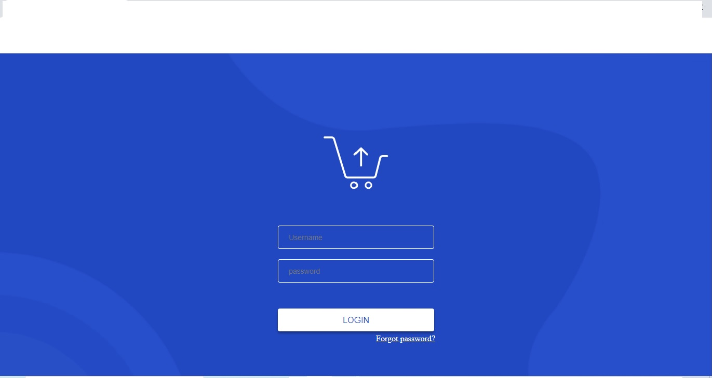

# PROJETO-LOGIN

### Ajustes e melhorias

O Projeto foi desenvolvido com as Tecnologia e voltadas nas seguintes Tarefas:

- [x] Criação do HTML
- [x] Criação do CSS

 🧑‍💻 Technologies e Tools I use:
 
 

 
 
 

 

### 🤝 Colaboradores

Agradecemos às seguintes pessoas que contribuíram para este projeto:

<table>
  <tr>
     <td align="center">
      <a href="#">
         
        
          <b>wanderson de farias</b>
        
        
      </a>
    </td>
   
  </tr>
</table>
  check application <a href="https://# 💻🏆

   
  

 My name is Wanderson  de farias
 desenvolvedor de site and landing page developer
I am studying systems analysis and development My focus is currently on the front end

* Hard  Skills:  / HTML / CSS / JavaScript/ SQL / Big Data e Analytic / Redes de Computadores /Gerência de Desenvolvimento de Software/Banco de Dados Relacionais e Não Relacionais/Arquitetura de Computadores de Operacionais/Gerenciamento de Redes de Computadores/
 MySQL /Banco de dados

 
 

 lest's get connected:
 
 
  
 
  
 
 
 
 
 

 
  
  

  
  
  
  
  
  🧑‍💻 Technologies e Tools I use:
 
 
 
 

 

  
    
    
  
    
   

   
    
   
  

  

  
 
  
  

  
  
  
  
  
  

.github.io/PROJETO-LOGIN/">HERE!</a>
